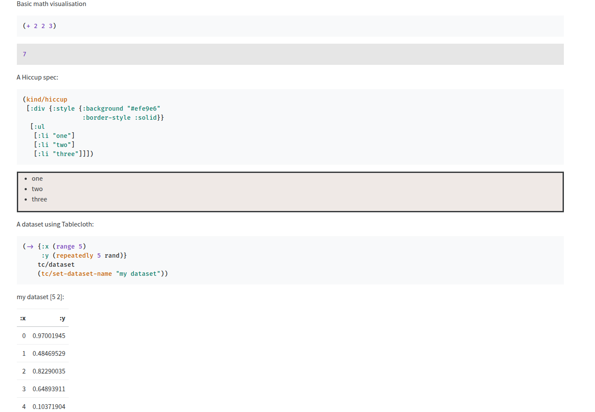

#  clay.nvim

**A Neovim plugin for working with [Clay](https://github.com/scicloj/clay), the minimalistic Clojure tool for data visualization and literate programming.**

---

##  What is Clay?

[Clay](https://github.com/scicloj/clay) is a minimalistic Clojure tool for **visual data exploration** and **literate programming**, designed with the [Kindly](https://scicloj.github.io/docs/kindly/) convention in mind.

With Clay, you can:
-  Create visualizations from your Clojure code  
-  Turn Clojure source and comments into rich HTML documents: blog posts, slideshows, reports, and more  
-  Explore data in a visual and expressive way

---

##  What is `clay.nvim`?

`clay.nvim` brings Clay closer to your fingers — right inside Neovim.  
This plugin adds custom functions that integrate with the Clay v2 API, making it easier to:

- Start Clay sessions   
- Evaluate code and see the output   
- Generate hiccup and HTML   

Current usage depends on [Conjure](https://github.com/Olical/conjure).

---

## ⚙️ Installation (with `lazy.nvim`)

```lua
{
  "radovanne/clay.nvim",
  dependencies = { "Olical/conjure" },
  ft = { "clojure" },
  config = function()
    local clay = require("clay")
    local wk = require("which-key")
    wk.add({
      { "<localleader>c", group = "Connect/Clay" },
      { "<localleader>cs", clay.start, desc = "Clay start" },
      { "<localleader>cS", clay.start_and_render, desc = "Clay start and render" },
      { "<localleader>cef", clay.eval_form, desc = "Clay eval form" },
      { "<localleader>cen", clay.eval_ns, desc = "Clay eval ns" },
      { "<localleader>ceh", clay.eval_ns_to_hiccup, desc = "Clay eval ns to hiccup" },
    })
  end,
}
```

>  No keybindings are enforced — you're free to set them up however you'd like.

---

##  Function List

Once you’ve configured it, try these in your Clojure files:

- `clay.start()` – starts a Clay session  
- `clay.start_and_render()` – starts a Clay session, evaluates the form under the cursor and renders it as html in the browser.  
- `clay.eval_form()` – evaluates the form under the cursor and renders it as html in the browser.  
- `clay.eval_ns()` – evaluates the current namespace and renders it as html in the browser.  
- `clay.eval_ns_to_hiccup()` – evaluates current namespace and prints in as a hiccup.

---


##  Example Usage

In deps.edn:
```clojure
{:paths ["src", "resources"]
 :deps {org.clojure/clojure {:mvn/version "1.12.0"}
        org.scicloj/clay {:mvn/version "2-beta39"}
        org.scicloj/kindly {:mvn/version "4-beta15"}
        scicloj/tablecloth {:mvn/version "7.042"}}}
```

In src/clay.clj:
```clojure
(ns clay
  (:require
   [scicloj.kindly.v4.kind :as kind]
   [scicloj.clay.v2.main]
   [tablecloth.api :as tc]))

;; Basic math visualisation
(+ 2 2 3)

;; A Hiccup spec:
(kind/hiccup
 [:div {:style {:background "#efe9e6"
                :border-style :solid}}
  [:ul
   [:li "one"]
   [:li "two"]
   [:li "three"]]])

;; A dataset using Tablecloth:
(-> {:x (range 5)
     :y (repeatedly 5 rand)}
    tc/dataset
    (tc/set-dataset-name "my dataset"))
```

Run clay_start and clay_eval_ns



---
Contributions are welcome!

That’s it — simple, minimal, and meant to stay out of your way   
Happy visualizing with Clay + Neovim! 
